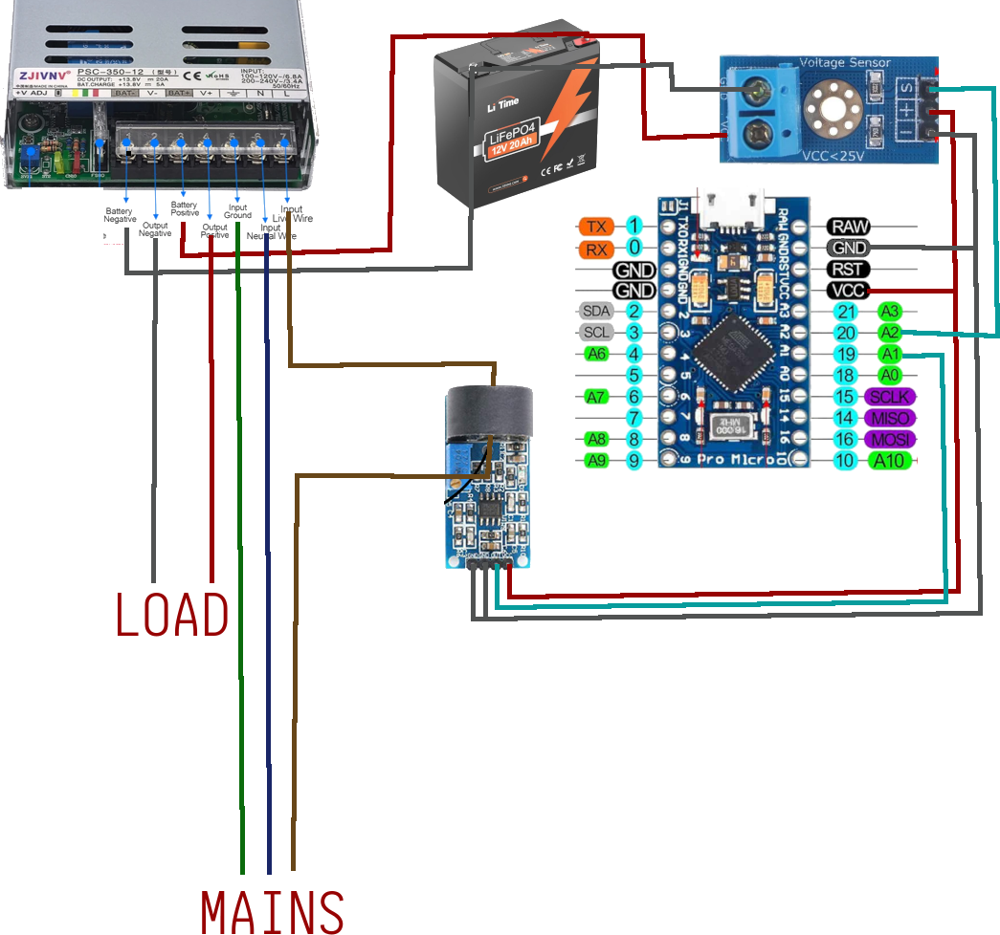

# ⚠️ DANGER: High Voltage Warning ⚠️

This project involves working with mains voltage (e.g., 120V/240V AC), which is **extremely dangerous** and can cause severe electrical shock, fire, injury, or even death.

  - **Qualified Individuals Only**: You should only attempt to build or use this project if you are a qualified individual with a thorough understanding of electrical safety and high-voltage circuits.
  - **Your Safety is Your Responsibility**: The author assumes no liability for any damage, injury, or loss of life resulting from the use or misuse of this project, its information, or its code. You are solely responsible for your own safety.
  - **When in Doubt, Don't Proceed**: If you are a beginner or are unsure about any aspect of this project, **DO NOT PROCEED**. Always prioritize safety above all else.

# 💡 mcuups Project

mcuups is a cost-effective and efficient DC-DC Uninterruptible Power Supply (UPS) solution. It uses off-the-shelf components to create a reliable backup system for your critical devices. It differs from [ArduinoUPS](https://github.com/8bitmcu/ArduinoUPS) as it makes use of the APC Serial driver instead of the Arduino USB driver. This resulsts in a much larger available chip selection.

  - ✅ **Ideal for small systems** under 400 watts.
  - ⚡ **Simple and efficient** DC-to-DC power conversion.
  - 🔋 **High-longevity LiFePO4 batteries** for reliable, long-term use.
  - 💸 **Affordable** with minimal components to assemble.
  - 🔌 **USB HID compatible** monitor your UPS through your OS or [NUT](https://github.com/networkupstools/nut).


#### Part 1: DC Power System

The core of this project is a DC Power Supply built with a dedicated UPS module and a LiFePO4 battery. While this hardware can function on its own, it lacks monitoring capabilities.

#### Part 2: Monitoring and Reporting

An Arduino-compatible microcontroller monitors the UPS's operational status and reports the data back to a connected computer using the [HIDPowerDevice](https://github.com/abratchik/HIDPowerDevice) library. This monitoring system is designed to be compatible with the Network UPS Tools ([NUT](https://github.com/networkupstools/nut)) framework.

-----

## 🛒 Bill of Materials (BOM)

You will need the following parts to build this project:

### Core Components

  * 1x **Microcontroller**: [Arduino](https://s.click.aliexpress.com/e/_c40KoCL9) (e.g., Arduino Nano). Any [board](https://docs.platformio.org/en/latest/boards/) supporting the arduino core, 5v and two analog pins should work. 
  * 1x **DC Voltage Sensor**: [DC Voltage Sensor Module](https://s.click.aliexpress.com/e/_oDO9SRN).
  * 1x **AC Current Sensor**: [ZMCT103C Module](https://s.click.aliexpress.com/e/_oo3mSPH).
  * 1x **PSU/UPS Module**: [250W](https://s.click.aliexpress.com/e/_oEvcbEr), [350W](https://s.click.aliexpress.com/e/_okWmb1V) or [500W](https://s.click.aliexpress.com/e/_c40LmCNZ). *Remember to choose a voltage (12V or 24V) that matches your system.*
  * 1x **Battery**: [LiFePO4 Battery](https://amzn.to/4oprkak) with a built-in BMS rated for 15A or higher.

### Voltage Converters (Choose based on your needs)

To power your equipment, you may need to stabilize the output voltage.

#### For a \~12V PSU Computer System

  * [125W PicoPSU (DC 6-24V Input)](https://www.mini-box.com/M3-ATX-DC-DC-ATX-Automotive-Computer-car-PC-Power-Supply)
  * [250W PicoPSU (DC 12-25V Input)](https://s.click.aliexpress.com/e/_oDlRFaP) - *Note: This unit's limited input range may not utilize your battery's full capacity.*
  * [400W PicoPSU (DC 5-34V Input)](https://s.click.aliexpress.com/e/_omeJSUf) - *Recommended for wider voltage compatibility.*

#### For a \~24V PSU Computer System

  * [300W Converter (DC 16-28V Input)](https://s.click.aliexpress.com/e/_op0HwJV)
  * [500W Converter (DC 16-60V Input)](https://s.click.aliexpress.com/e/_ooraGpZ)

#### For Modems, Switches & Other Low-Voltage Gear

  * [3A Buck-Boost (1.25-26V Output)](https://s.click.aliexpress.com/e/_opfwM1Z)
  * [3A Buck-Boost (0.5-30V Output)](https://s.click.aliexpress.com/e/_ooifDCx)
  * [Fixed-Voltage Buck-Boost (1-5A, 9-36V Input)](https://s.click.aliexpress.com/e/_oFBA1GF) - *I really like these\!*
  * [Fixed-Voltage Buck-Boost (15-30A, 9-36V Input)](https://s.click.aliexpress.com/e/_oCNc0DF)
  * [5V Fixed-Voltage Buck (3-10A, 8-40V Input)](https://s.click.aliexpress.com/e/_oFlQC7n)
-----

## 📝 Important Notes & Best Practices

Follow these tips for a safe and successful build:

  * **Measure Your Max Load**: Before buying parts, use a [Kill-A-Watt meter](https://amzn.to/4ftgFrc) (or similar device) to measure your system's peak power consumption. Ensure it's well within the capacity of your chosen battery and PSU/UPS module.
  * **Don't Skimp on the BMS**: Your battery's BMS determines the maximum power output. A 15A BMS can deliver \~192W (12.8V \* 15A), while a 20A BMS can deliver \~256W. When in doubt, oversize it\!
  * **Adjust the PSU/UPS Voltage**: You may need to tune the adjustable potentiometer on the PSU/UPS module. A setting of \~14.4V is often a good target for LiFePO4 charging.
  * **Use a Wide-Voltage PicoPSU**: Since the PSU/UPS output can be as high as 14.4V, choose a PicoPSU with a wide input voltage range to ensure stability and safety.
  * **Stay Under 80% Load**: For longevity, do not continuously exceed 80% of your PSU/UPS module's maximum rated load. For the 250W unit, stay under 200W. For the 350W unit, stay under 280W. For the 500W unit, stay under 400W.
  * **Select the Correct Wire Gauge**: Use battery cables thick enough for your system's electrical load and cable length. Undersized wires can be a fire hazard.

-----

## 🔌 Wiring



-----

## 🛠️ Software & Setup

### Dependencies

You will need [PlatformIO](https://platformio.org) to build and flash the firmware. You can install the [PlatformIO IDE extension for VSCode](https://platformio.org/install/ide?install=vscode) or use PlatformIO Core (CLI).

> **Alternative**: You can use the Arduino IDE, but you will need to:
>
> 1.  Rename `src/main.cpp` to `src/mcuups.ino`.
> 2.  Manually install the libraries listed in the `platformio.ini` file.

### Hardware Calibration

Before flashing the main project, you must calibrate the **ZMCT103C current sensor** and the **voltage sensor module**. A dedicated project in the `calib` folder is provided to simplify this process.

1.  **Wiring:** Assemble the circuit according to the provided wiring diagram.

2.  **Set Reference Voltage:** Edit the `calib/src/main.cpp` file and set the `BATTERY_KNOWNVOLTAGE` variable. This must be a stable, known voltage (from a battery or bench power supply) that you provide to the voltage sensor.

    > **Tip:** Use a reference voltage that falls within your battery's typical operating range for best results.

3.  **Connect Known Load:** Attach a predictable AC load, such as an incandescent lightbulb, for the ZMCT103C module to measure.

4.  **Upload Calibration Code:** Open a terminal in the `calib` directory and run the following PlatformIO command:

    ```bash
    pio run --target upload
    ```

5.  **Monitor Serial Output:** Connect a serial monitor (e.g., `screen` on Linux or `PuTTY` on Windows) to your device at a **57600** baud rate.

6.  **Record Voltage Factor:** From the serial output, find and record the average calculated `BATTERY_VOLTAGE_FACTOR`. You will need this value for the main project's configuration.

7.  **Calibrate Current Sensor:** While watching the serial monitor, slowly turn the potentiometer on the ZMCT103C module until the displayed "AC Mains Current" matches your known load's current draw.


### Project Configuration

You **must edit `src/config.h`** to configure the project for your specific hardware and needs.

1.  **Set Voltage Factor:** Update the `BATTERY_VOLTAGE_FACTOR` variable with the value you recorded during the hardware calibration step.

2.  **Define Battery Voltage Range:** Configure the **maximum** (fully charged) and **minimum** (fully discharged) voltage levels for your battery.

3.  **Estimate Runtime:** Set the battery's estimated runtime. You can calculate this by dividing your battery's capacity in Watt-hours (Wh) by the average power draw of your load in Watts (W).
    > **Formula:**
    > _Runtime (hours) = Battery Capacity (Wh) / Average Load (W)_

-----

## 🚀 Building and Flashing

1.  Connect your Arduino board to your computer.
2.  Open a terminal in the project directory.
3.  Run the following PlatformIO command:
    ```bash
    pio run --target upload
    ```

-----

## 🖥️ Computer Configuration

1.  **Configure NUT:**
    * Use the provided `ups.conf` file as an example.
